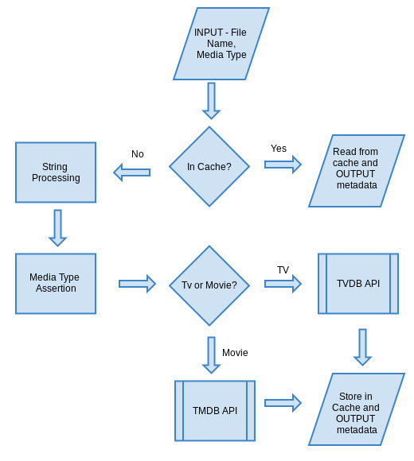

Metadata Handler
==========
We have created a metadata library that helps us retrieve metadata information and artwork about media files.


Here is a high level picture of how the library works:


Install
=======
`go get github.com/amahi/go-metadata`

Details
=======
* In our implementation of this library L, the origin server acts as a client to the library
* The main entry point to L is method/function call with a media name(string) whose metadata we return in a structured way
* Format of the metadata returned will be a json structure with details such as cast, director, and url of cover art images that are related to it. There may be more than one call for this information separately
* The library keeps a transparent cache as part of the implementation
* Whenever L gets a request from the client, it queries a local database (the cache) to find if the requested information is present in cache already
* If it is present, L reads the data from cache and returns it
* Otherwise S will request metadata from an online API, return the results as soon as possible and cache it
* The cache should use a caching policy, like LRU

Metadata Output
============
```go
Lib,err := metadata.Init(1000000,"metdata.db")
data, err := Lib.GetMetadata("MythBusters - 7x14 - Dirty vs. Clean Car","tv")
```

The above code will return a json string in the following format:-

```json
{
   "Media_type":"tv",
   "Title":"MythBusters",
   "Artwork":"http://thetvdb.com/banners/posters/73388-2.jpg",
   "Release_date":"2003-01-23"
}
```
