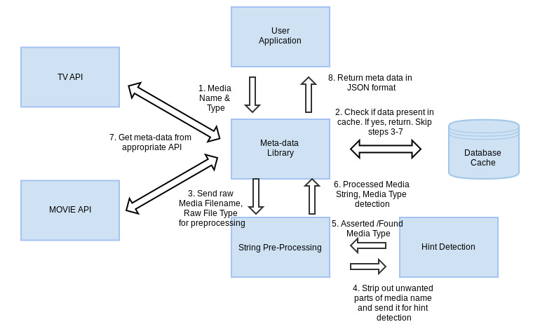

Metadata Handler
==========
We are creating a metadata library to be used in a server that helps us retrieve metadata information and artwork about media files. Here is a high level picture of how the library works: 

Details
=======
* In our implementation of this library L, the origin server acts as a client to the library
* The main entry point to L will be a method/function call with a media name(string) whose metadata we return in a structured way
* Format of the metadata returned will be a json structure with details such as cast, director, and url of cover art images that are related to it. There may be more than one call for this information separately
* The library keeps a transparent cache as part of the implementation
* Whenever L gets a request from the client, it queries a local database (the cache) to find if the requested information is present in cache already
* If it is present, L reads the data from cache and returns it
* Otherwise S will request metadata from an online API, return the results as soon as possible and cache it
* The cache should use a caching policy, like LRU
